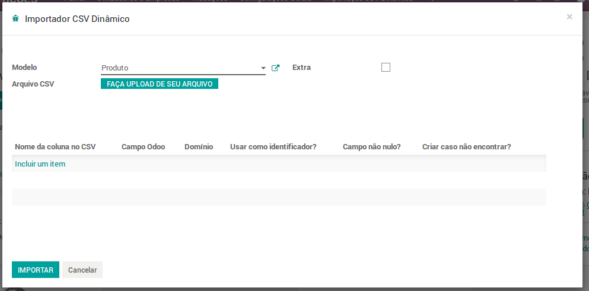
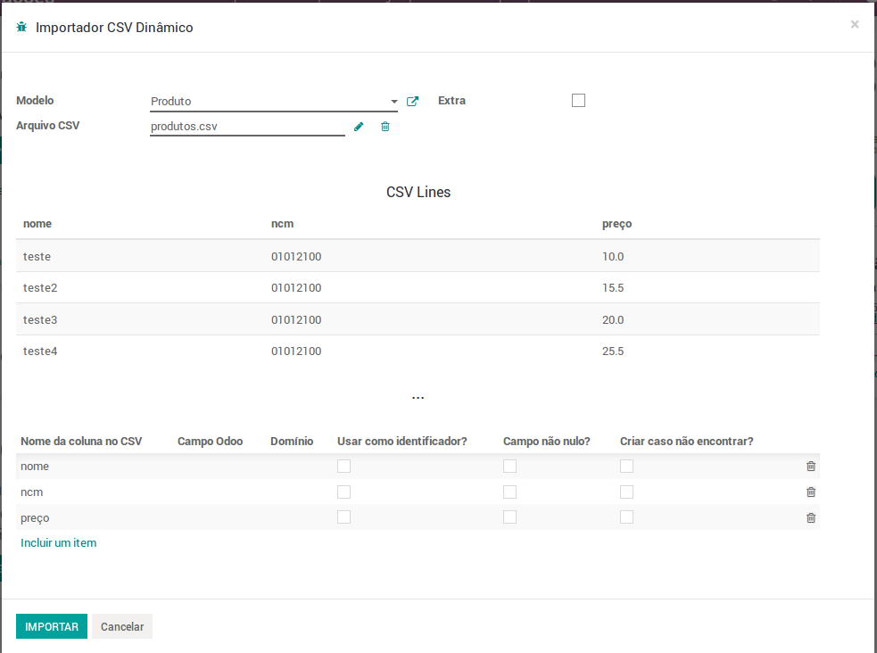
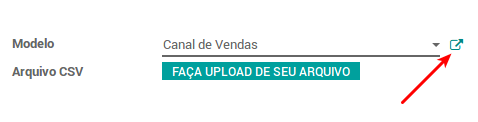
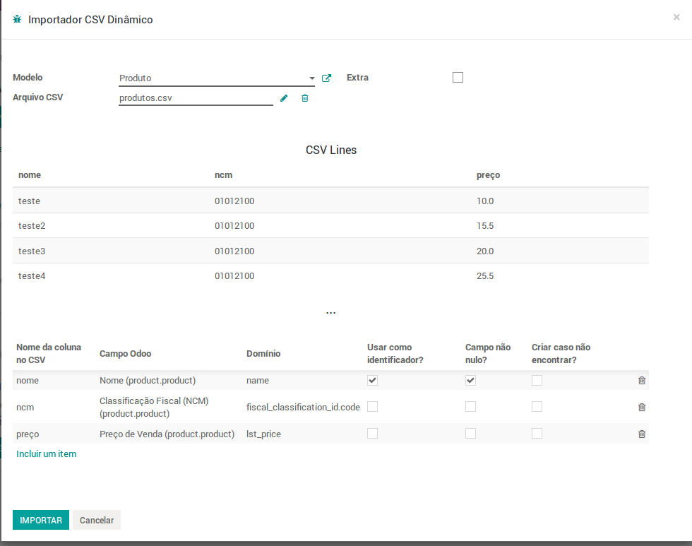

# Dynamic CSV Importer #

Como o próprio nome já diz, esse módulo faz a importação de dados de um arquivo .csv em todos (ou quase todos) os módulos.

**Table of Contents**

- [Instalação](#instalação)
- [Instruções de Uso](#instruções-de-uso)
  - [Configuração da Importação](#tabela-de-importação)
- [Mensagens de Erros](#mensagens-de-erros)

## Instalação ##

Procedimento usual, o mesmo de sempre.
*Aplicativo > 'dynamic_csv_importer' no campo de busca > Instalar*

Caso a busca pelo módulo não retorne nenhum resultado, *Ative o modo debug > Atualizar Lista de Aplicativos* pode resolver esse problema.

## Instruções de Uso ##

Na tela inicial do Odoo:
*Configurações > Importação CSV Dinâmica*

Isso irá abrir um wizard/janela. Esse carinha é o Importer.

No campo **Modelo**, selecione o modelo em que serão importados registros. 
Lembrando que ele só irá mostrar os modelos instalados na sua base local, 
então caso algum modelo não esteja ali, é provável que o mesmo não tenha sido 
instalado na base.

Aqui eu irei importar produtos:

O campo **Extra** mostra algumas configurações extras:*Caracter Delimitador*, 
*Caracter de Citação*, os quais já possuem valores default: , e " respectivamente.

O campo **Arquivo CSV** é para selecionar o arquivo .csv a ser importado.

Após selecionar o arquivo, o wizard ficará algo parecido com isso:

Na primeira tabela mostra as 5 primeiras linhas do arquivo.

Já na segunda tabela é onde será configurado os dados da importação.

Caso tenha selecionado um arquivo por engano, é possivel trocar o arquivo sem
ter que fechar e abrir o wizard novamente.

O campo **Criar objeto caso não for encontrado** é para casos onde não há registros
no sistema com os dados informados nas linhas selecionadas como **Identificador**.
Nesses casos, um registro será criado, com os atributos passados como identificadores.

### Tabela de Importação ###

Cada linha dessa tabela é uma coluna do arquivo .csv importado. Logo, se o arquivo
tinha as colunas *id, name, unidade_tributacao*, a tabela terá essas mesmas 3 linhas.

Nesse exemplo, usarei um arquivo .csv com 3 colunas: *nome, NCM, preço*

Em cada linha da tabela terão:

**Campo Odoo**:  Selection com os campos do modelo selecionado.

**Domínio**:  É como o campo é referenciado dentro do sistema.
Esse campo geralmente é setado automaticamente. Porém, há a possibilidade de
modificá-lo se for preciso. Isso é útil quando a importação de registros está
ligada a um outro objeto do sistema, para informar qual atributo do objeto que
temos em mãos.
Para descobrir qual atributo que o mesmo está ligado, basta buscar no Modelo:

Neste exemplo, eu tenho apenas o código do NCM.
Portanto, é preciso informar ao importador qual campo que corresponde o dado
do arquivo .csv.
Para isso, eu posso selecionar NCM no **Campo Odoo** e depois adicionar '.code'
no final do dominio, pois o dado que eu tenho corresponde ao campo 'code' do NCM.

**Usar como identificador?**:  As linhas que tiverem essa opção selecionada serão
usadas como dados para a busca do registro.
Exemplo:
Se a linha 'name' for selecionada como identificadora, na hora de importar, o 
sistema irá procurar pro um registro do modelo selecionado que tenha o nome
igual ao valor passado no arquivo .csv.
**PS: É altamente recomendável selecionar a opção _Campo não nulo_ nesses campos!**
Isso porque não é possivel, e também faz pouco sentido atualizar/criar/identificar
qualquer objeto com valor nulo.

**Campo não nulo?**:  As linhas que tiverem essa opção selecionada não poderão ter
valores vazios. Caso tenha, será mostrado na tela as linhas que tiveram problemas.
É altamente recomendado que selecione essa opção em linhas com informações importantes,
como linhas identificadoras.

**Criar caso não encontrar?**:  Essa opção permite que o usuário crie um
registro com o valor passado caso ele não exista no sistema.
**Porém, tenha cuidado ao usar essa opção.** Podem ocorrer casos onde algum
campo obrigatório não esteja selecionado e então dar erro. Outro caso possível
é criar registros duplicados, quando o mesmo é um objeto.

Ex:
Digamos que haja um registro NCM código 99999999 com nome Teste.
Houve uma importação de Produtos. O valor da coluna NCM é o código dele e o
código '99999999' não estava cadastrado no sistema. O sistema então irá
criar um registro com esse código.
Numa outra importação de Produtos, a coluna NCM estava com valores do tipo 'nome NCM'.
Em uma das linhas, tinha o valor 'Teste'. O sistema então irá
perceber que não há nenhum registro com esse nome. Ele irá, então, criar
outro registro apenas com o nome Teste.

O exemplo foi meio forçado, mas passa a ideia de que podem ser criados registros
duplicados de um mesmo objeto, caso esse campo seja usado de fora errada.

*Caso alguma linha da segunda tabela não precise ser importada, apenas deixe o campo* **Domínio** *vazio.*

Nesse exemplo, os domínios ficarão assim:

Quando tudo estiver pronto, só clicar no botão **IMPORTAR**, que as coisas irão acontecer.

## Mensagens de Erros ##
- **Nenhum arquivo CSV selecionado!**
Indica que não foi selecionado um arquivo .csv

- **Nenhum caracter de citação informado. Por favor, coloque um caracter de citação antes de prosseguir.**
Significa que o campo **Caracter de citação** está vazio. Para verificar isso, selecione o checkbox
**Extra** que irá surgir o campo para colocar o caracter de citação.

- **Não há linhas de identificação! Por favor, selecione pelo menos uma linha como identificadora antes de prosseguir.**
Indica que não há linhas com o checkbox **Usar como identificador?** selecionado.

- **Não há linhas para importação com domínio detectadas! Por favor selecione um campo odoo ou coloque um domínio em pelo menos uma linha antes de prosseguir.**
Indica que não há linhas com o campo **Domínio** preenchido.

  **PS: Linhas sem domínio são ignoradas na importação**

- **Linha nº: x - Valor vazio em campo não nulo**
Isso significa que na linha x, há um valor vazio num campo em quem não é aceito tal valor (Checkbox não nulo selecionado)

- **Linha nº: x com valor 'valor' não foi encontrado no sistema**
Na linha x, o valor indicado não foi encontrado no sistema. Ele aparece quando é fornecido um
atributo de um objeto (id, name, int_ref) que não está presente no sistema. Em caso de nomes,
prestem atenção em acentos, espaços antes/depois extras, etc.
